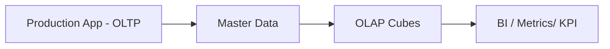
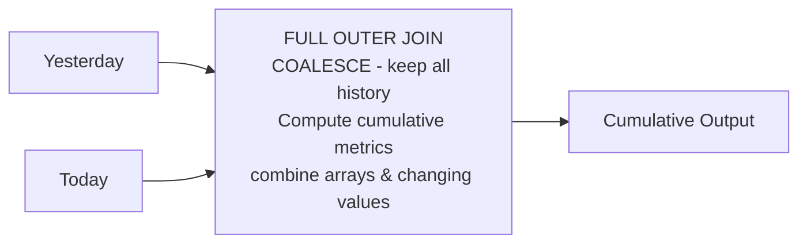
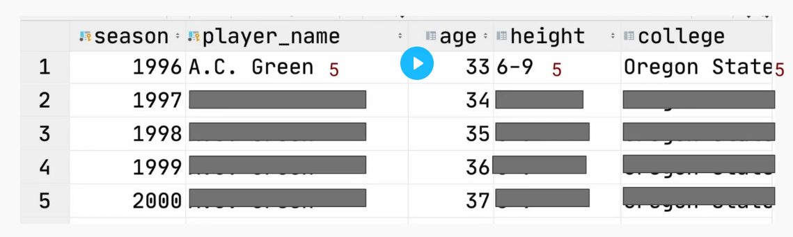
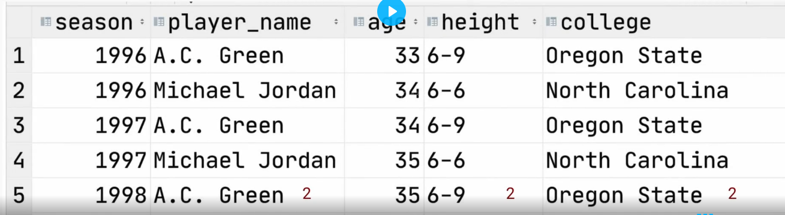

# Dim Data Modeling

SCD vs fixed dimension

## Knowing your Consumer
| who       | description                                             |
|-----------|---------------------------------------------------------|
| DS, DA    | easy to query flattened data, proper naming             |
| DE        | complex data (like nested data) is fine                 |
| ML        | almost same as 1 but sometimes don't need proper naming |
| Customers | easy to be made into charts                             |

## Types of dim data modelling
| types       | description                                           |
|-------------|-------------------------------------------------------|
| OLTP        | optimised for write speed, 1-row dataset but frequent |
| OLAP        | optimised for read speed, large datasets in 1 go      |
| Master Data | middle ground for OLTP and OLAP - SOURCE of truth                       |

## Typical flow

## Cumulative Table Design

| Strength                      | Weakness                       |
|-------------------------------|--------------------------------|
| Trace history w/o aggregation | Sequential(or series) backfill |
| Easy 'time travel'            | messy when need to use filter  |

## Compactness vs Usability
| Simplest table                       | Most compact table                              | Middle ground table  |
|--------------------------------------|-------------------------------------------------|----------------------|
| Data in simplest form                | Compressed as small as possible                 | Complex data type    |
| Easy to query                        | Not human readable                              | (Array, Map, Struct) |
| Analytics (less technical consumers) | Software (highly technical & latency dependent) | Other Data Engineers |

## Struct vs Array vs Map
| Struct                                        | Map                                           | Array                      |
|-----------------------------------------------|-----------------------------------------------|----------------------------|
| Keys are rigidly defined, compression is good | Keys are loosely defined, compression is okay | Ordinal                    |
| Values (any type)                             | Values (same type)                            | List of values (same type) |

## Cardinality Explosion in Temporal Dimension
The author talked about how correct **sorting** is important in large parquet files compression using **run length encoding compression**.

and how **spark shuffles** can disturb this kind of sorting.

### Two Option
- make sure all downstream engineers do the correct sorting after shuffling
- Model data in a way like nested. He will show in lab. This also explained why some labs I did in gcp course also mentioned about nested rows.