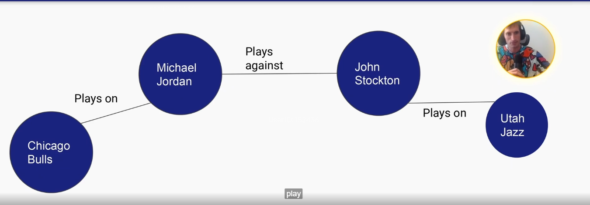

## Additive
### What is Additive Dim
- means we do not **'double count'**
- An additive dim cannot have 2 different values at the same time.

### How does additivity help
- Do not need to use `COUNT(DISTINCT)`
- Usually only affect `COUNT` but not `SUM`
- Usually revolve around users (A person can possess 2 items at the same time)

## ENUM
- like data validation in excel
### Why we should use
- built in **data quality**, **static fields** & **documentation**
- subpartition: convert bigdata problem into pieces
- useful when have multiple sources mapping into **shared schema**

## Flexible Schema
| Pros                      | Cons                      |
|---------------------------|---------------------------|
| No need `ALTER TABLE`     | Bad compression           |
| Can manage more columns   | Readability, Queryability |
| Don't have `NULL` columns |                           |
| Other_properties column   |                           |

## Graph Data Model
### How is it different
- **relationship** focused, not entity focused
- usually looks like

| ITEM         | TYPE                 |
|--------------|----------------------|
| Subject_id   | STRING               |
| Subject_type | VERTEX TYPE          |
| Object_id    | STRING               |
| Object_type  | VERTEX TYPE          |
| Edge_type    | EDGE_TYPE            |
| Properties   | MAP <STRING, STRING> |

### Graph Diagram
