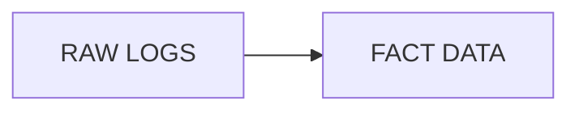
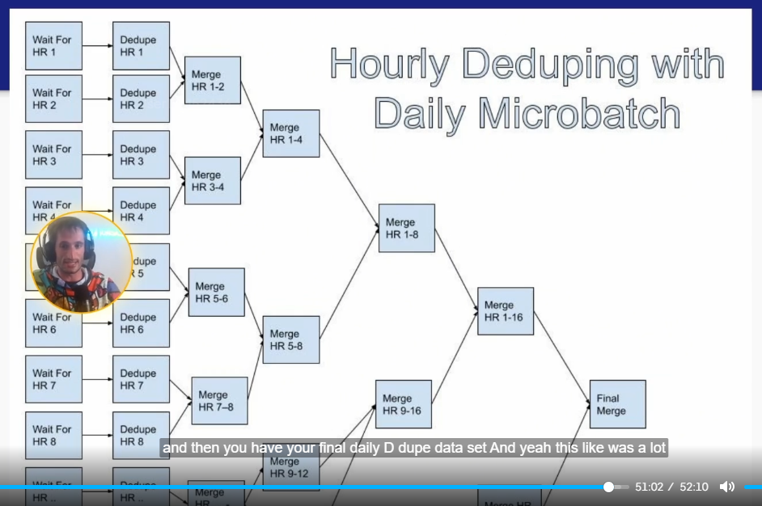

# Fact Data Modeling
What is a fact?
- sth that happened (in the past)
- not slowly changing
- atomic vs aggregated (running a step vs a mile)

## Why is it hard
- usually 10-100x of dimension (a user can have 2000 events)
- need lots of context for effective analysis
- lots of duplicates

## Normalized vs Denormalized
- Normalized: Need to use ID to join (write optimised)
- Denormalized: Aggregates different dims for quicker analysis (read optimised)

## Raw logs vs Fact Data

| Raw Logs                                                                 | Fact Data          |
|--------------------------------------------------------------------------|--------------------|
| Ugly schemas, highly granular, optimised for software, make analysis hard | Nice column names, smaller than logs  |
| More duplicates & quality issues                                         | Quality guarantees |
| Shorter retention                                                        | Longer retention   |

## 4Ws & H (no Y) - Normal Patterns in Fact Table
### Dim
- Who: IDs
- Where: usually modelled out, link with ID
- How: usually modelled out, link with ID
### Fact - nature of the event
- What happend? : usually NOT NULL
- When it happened? : usually NOT NULL

## When to include other Dim into fact table (denormalization)
- normal practice: only ID in fact table. Use JOIN. (normalized)
- but using JOIN can get too long if the fact table is huge.
- tradeoff between storage & speed

## How logging affects fact-data-modeling
- usually logs should have all the data needed for fact table (done in colab w software/system engineer)
- **DO NOT LOG EVERYTHING**. Log only what is needed.
- Logging should follow rules/tests set by everyone. (Apache **Thrift**)

## Common Modeling Techniques
### Sampling
- Works when precision is not strictly required.
- Doesn't work on cases like **security** requirement.
### Bucketing (partitioning)
- pre-partitioning important dim, avoiding slow shuffling
- Sorted-merge Bucket (SMB) joins w/o shuffle at all.
### Broadcast JOIN
- only works when one side of the table is small

## Retention period
Depending on companies, fact table can be costly to hold.
- normally, if <10TBs, 60-90 days
- if > 100TBs, VERY SHORT RETENTION (14 days)

## Deduplication
- depend on context, can be deduplicated
- look at distribution of duplicates
- dedup whole table in one go can take very long
- options (day): Streaming, microbatch
### Streaming
- depend on data size & memory
- 15min to hourly usually the best
### micro batch
#### Step 1
- (`SUM` & `COUNT` with `GROUP BY`) each hour data
- `COLLECT_LIST` to collect metadata in case they are different
#### Step 2
- `FULL OUTER JOIN` duplicates between hours
- String: `CONCAT` OR INT: left.value + right.value
