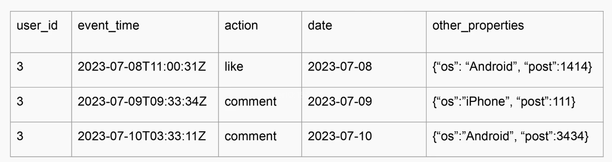
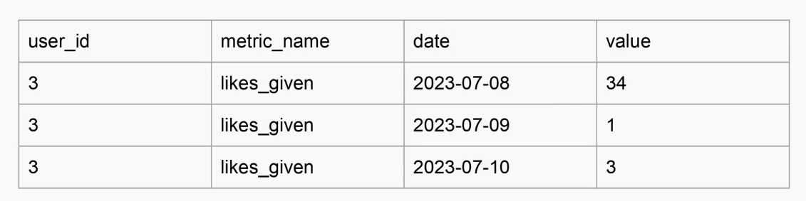
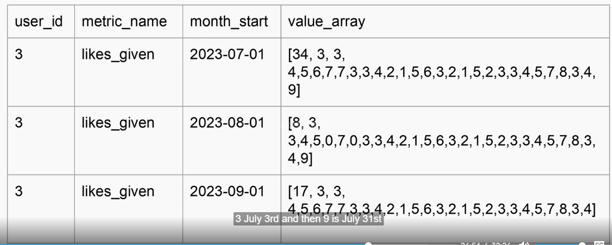

# Minimize shuffles

## Why
- enemy of parallelism

## Types of shuffles
| Best   | Kinda parallel | Worst    |
|--------|----------------|----------|
| SELECT | GROUP BY       | ORDER BY |
| FROM   | JOIN           |          |
| WHERE  | HAVING         |          |

## Efficient shuffles
- pre-bucketizing 
- REDUCE DATA VOLUME before shuffling
- All events (atomic) --> high volume
- Aggregated events daily --> medium volume
- Aggregated events monthly/yearly --> smallest volume

### Atomic example
- stores everything but slow to answer history

### Daily example

### Month example
- stores data in days but in arrays (not aggregate in Month)

Tracking slowly changing dimensions (SCDs) with full accuracy can be very expensive when you join them to big fact tables.

To make queries faster, you often don’t track changes day-by-day.

Instead, you freeze the dimension values at specific snapshot points (like the start or end of each month).

This means you lose some precision (you won’t always know the exact value on a given day), but you gain a big performance boost.

👉 In short: you trade perfect accuracy for speed, by only keeping dimension history at coarse checkpoints (e.g., month start).