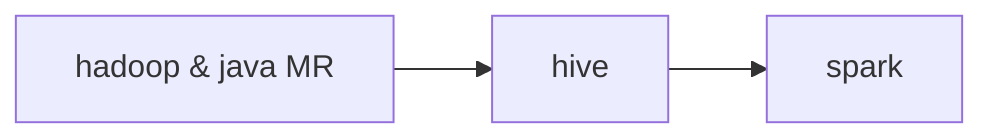
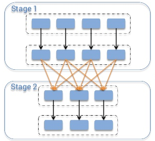

# Spark
- distributed compute framework that allows efficient processing of big data

### Why use Spark?
- effective usage of RAM
- storage agnostic 
    - decouple storage & compute, avoid vendor lock-in
- large community

### Why not use Spark?
- learning curve 
- if company already has adopted sth else

## Spark components
- plan (gameplay)
- driver (coach)
- executors (players)

### Plan (play)
- transformation code (python, scala, SQL)
- lazy evaluation: only run when need to
    - writing output
    - when later part need data
        - e.g. dataframe.collect()

### Driver (coach)
- driver reads the plan

| Setting                           | Description                                                       |
|-----------------------------------|-------------------------------------------------------------------|
| spark.driver.memory               | Heap memory. Related to data transformations: dataframe.collect() |
| spark.driver.memoryOverheadFactor | Non heap memory. Usually 10%. Related to languages and runtime.   |

- driver determines:
    - how to `JOIN`
    - when to be not lazy: dataframe.collect()
    - how much parallelism each step needs

### executors (players)
- driver passes the plan to executors

| Setting                             | Description                                                |
|-------------------------------------|------------------------------------------------------------|
| spark.executor.memory               | 2/4/6/8/10/12/14/16. Test till no OOM                       |
| spark.executor.cores                | 4 to 6                                                     |
| spark.executor.memoryOverheadFactor | Non heap memory. Usually 10%. Increase if have lots of UDF |

## Types of JOINs in Spark
| Shuffle sort-merge join | Broadcast hash join                                                   | Bucket join     |
|-------------------------|-----------------------------------------------------------------------|-----------------|
| Least performant (<20TBs)       | Average                                                               | Most performant |
| Most versatile          | When one side of join is small                                        |                 |
| Default since 2.3       | spark.sql.autoBroadcastJoinThreshold (default 10MBs, problems > 1GBs) |                 |
| With shuffle            | W/O shuffle                                                           | W/O shuffle     |

## Shuffle
### how shuffle works (sort-merge JOIN)

### Partition vs Parallelism
- **spark.sql.shuffle.partitions** vs **spark.default.parallelism** (same for the most parts)
- just use **spark.sql.shuffle.partitions**. Other is related to RDD API

### Good or bad
- makes life easier
- At high volumes (>10TBs), performance drops

### minimize high volume shuffles
- bucket the data if many JOINs happens downstream
- only works if two tables are multiples of each other
    - always use **power of 2** for # of buckets

## Skew
- some partitions have significantly more data than others
- either from 
    - too little partitions
    - the way the data is

### how to detect if data is skewed
- job getting to 99%, run forever and fail
- scientific way like box and whisker plot (tutor mentioned he rarely used it)

### how to deal with skew
- adaptive query execution (only in Spark 3+)
    - Set spark.sql.adaptive.enabled = True
- salt column: adding an extra column with randomised number
    - and then do grouping twice
    - double check correctness
- filter outliers / split into different jobs

## Databricks vs Regular Spark
|                          | Databricks                 | Unmanaged Spark (Big tech companies) |
|--------------------------|----------------------------|----------------------------|
| Should you use notebook? | YES!                       | Only for proof of concepts |
| How to test job?         | Run the notebook           | spark-submit from CLI      |
| Version Control          | Git or notebook versioning | Git                        |

## tips
### check spark plans
- use explain() on dataframe

### data source
- literally everywhere
- but REST API is not spark friendly as it usually happens on the driver

### Output
- should almost always partition on 'date'