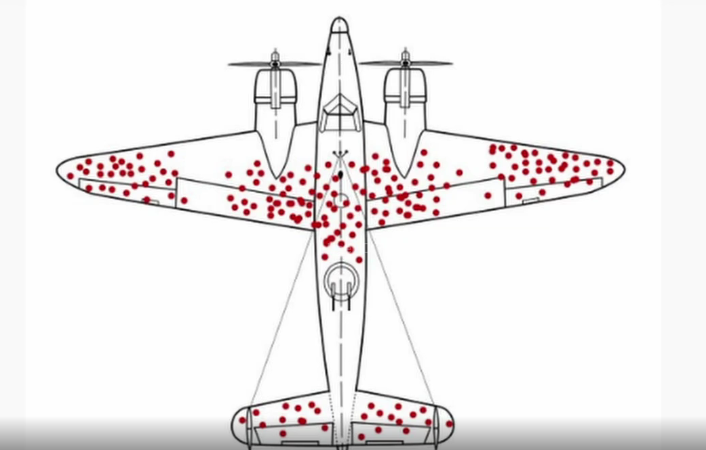
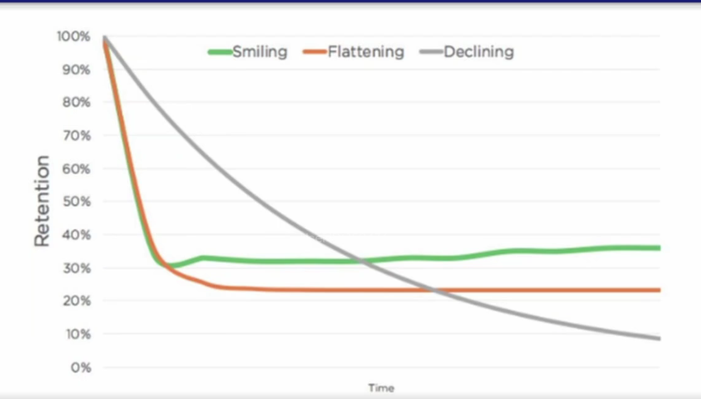
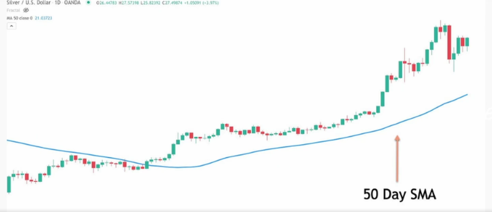

# Analytical Patterns

## Repeatable Analysis
- Reduce cognitive load of thinking about SQL 
- Streamline your impact

# Common Patterns
- Aggregation-based
- Cumulation-based
- Window-based

## Aggregation-based
- most commonly used
- `GROUP BY`
- Upstream data is often daily metrics
- examples:
    - root cause analysis
    - trends
    - composition
- thnk about combination that matters the most
- be careful when handling many combinations, long timeframe (cardinality can get high)

## Cumulation-based
- State transition tracking
- Retention (J curves): Survival Analysis
- `FULL OUTER JOIN`
- Time is a dimension here (no data is data)

### Growth accounting (a type of state transition)
| State       | yesterday    | today    |
|-------------|--------------|----------|
| New         | Didn't exist | Active   |
| Retained    | Active       | Active   |
| Churned     | Active       | Inactive |
| Resurrected | Inactive     | Active   |
| Stale       | Inactive     | Inactive |

### Survival Analysis (bias)
parts that need strengthening are the white parts

#### J curve
- shows how well the app is doing since cohort (signup, launch)

| Curve                                                   | State Check         | Reference Date  |
|---------------------------------------------------------|---------------------|-----------------|
| Users who stay active                                   | Activity on the app | Sign up date    |
| Cancer patients who continue to live                    | Not dead            | Diagnosis date  |
| Smokers who remain smoke-free after quitting            | Not smoking         | Quit date       |
| Boot camp attendees who keep attending all the sessions | Activity on Zoom    | Enrollment date |

## Window-based
- DoD/WoW/MoM/YoY
- Rolling sum/average
- Ranking
- `FUNCTION OVER`(`PARTITION BY` key `ORDER BY` sort `ROWS BETWEEN` n `PRECEDING AND CURRENT ROW`)
- make sure partition by sth for bigdata to prevent OOM
