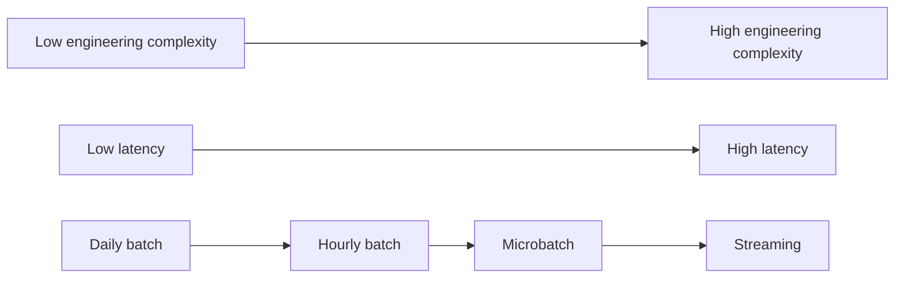

# Streaming

## Contents
- Flink
- Kafka
- Real-time processing
- Connect to a cloud Kafka cluster
- Work with clickstream data
- Advanced windowing functions
    - Count window
    - Sliding window
    - Session window

## What is streaming
- process data in a low-latency way

### Streaming vs near real-time vs real-time
- real-time rarely means streaming
- usually means near real-time (predictable refresh rate)
- related to SLA - service-level agreement

|                        | Streaming             | Near real-time                      |
|------------------------|-----------------------|-------------------------------------|
| When data is processed | As soon as generated. | In small batches every few minutes. |
| Example                | Flink                 | Spark Structured Streaming          |

### Should we use streaming (considerations)?
- skills on the team
- benefits of migration
- Homogeneity of pipelines
- tradeoff between daily batch, hourly batch, micro batch & streaming
- data quality concern (streaming DQ is hard)

### Streaming use cases
- Fraud detection
- High frequency trading
- Live event processing

### Gray area use cases (micro batch can work too)
- data served to customers
- reducing latency upstream of master data

### Streaming -> Batch Continuum

- real-time is a myth (not instant)
- more laggy when scale goes up or more hops (event->kafka->Flink->sink) are involved

### Structure of a streaming pipeline
| Sources                              | Compute                           | Sink                   |
|--------------------------------------|-----------------------------------|------------------------|
| Kafka, RabbitMQ                      | Flink, Spark Structured Streaming | Another Kafka topic    |
| Side inputs (dim that seldom change) | Process the data                  | DB - iceberg, postgres |

### Streaming Challenges
- out of order events (use watermark)
- late arriving data
- recovering from failures
    - offsets: earliest offset, latest offset, specific timestamp
    - checkpoints (flink internal)
    - savepoints (external systems)