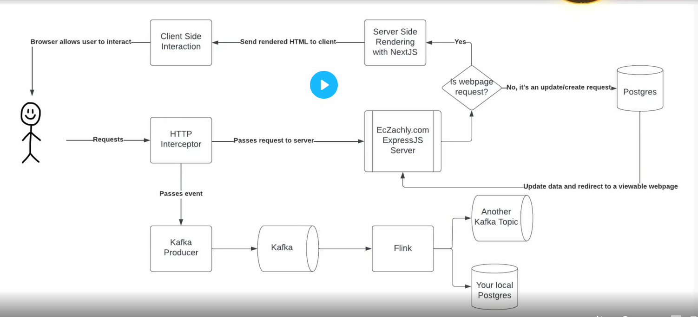
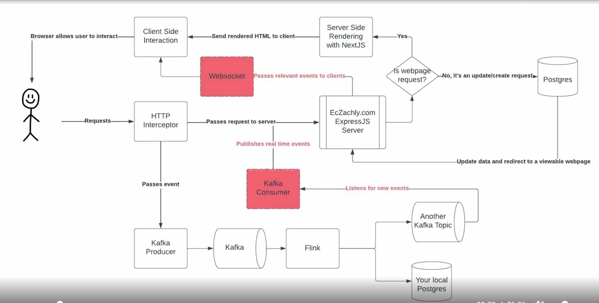

# Streaming Pipelines: Exploring processing part

## Streaming needs lots of pieces to work


## HTTP Interceptor
```javascript
export default function createAPIEventMiddleware(req, res, next) {
    const shouldBeLogged = 
        req.url && !req.hostname.includes('localhost') && !isFileRequest(req);
    const event = {
        url: req.url,
        referrer: req.headers.referrer,
        user_agent: JSON.stringify(userAgent.parse(req.headers['user-agent'])),
        headers: JSON.stringify(req.headers),
        host: req.headers.host,
        ip: req.connection.remoteAddress,
        event_time: new Date(),
    };
    if (shouldBeLogged) {
        Promise.all([
            sendMessageToKafka({...event}),
        ]).then(() => {
            next();
        });
    } else {
        next();
    }
}
```
## Kafka Producer
```javascript
export default function sendMessageToKafka(message: object) {
    const producer = new Kafka.Producer({
        connectionString: process.env.KAFKA_URL,
        ssl: {cert: process.env.KAFKA_CLIENT_CERT...},
    });

    const messageObject = {
        topic: 'porcupine-78436.bootcamp-events',
        message: {...},
    } as Message;

    producer
    .init()
    .then(() => {
        return producer.send(data: [messageObject]);
    })
    .then((result) => {
        console.log('Message sent successfully', result);
        return producer.end();
    })
    .catch((err) => {
        console.error('Error sending message', err);
        return producer.end();
    });
}
```

## Future version of tutor's website


## Lambda vs Kappa Architecture
| Lambda Architecture                 | Kappa Architecture                                                         |
|-------------------------------------|----------------------------------------------------------------------------|
| double the code (with batch)        | Cons: need to read things sequentially                                     |
| optimizes for latency & correctness | Pros: Least complex, least lag                                             |
| Cons: complexity                    | delta lake, iceberg, hudi are trying to make this architecture more viable |
| Pros: Data quality checks           |                                                                            |

## Flink UDFs
- UDFs generally won't perform as well as built-in functions
    - Only use UDFs for custom needs
    - Python UDFs is even slower since Flink isn't python native.

## Flink Windows
- Count
- Tumbling
- Sliding
- Session

### Count
- N number of events (if N is predictable)
- can specify timeout since not everyone can finish the funnel

### Tumbling
- fixed, no overlap
- similar to batch hourly
- great for chunking data

### Sliding
- has overlap
- capture more windows
- great for finding 'peak-use' windows
- handling 'across-midnight' exception

### Session
- variable length
- based on activity

## Watermarks vs Allowed Lateness
| Watermark                            | Allowed Lateness                                                                 |
|--------------------------------------|----------------------------------------------------------------------------------|
| define when window will execute      | usually set to 0                                                                 |
| help ordering of out-of-order events | Allow reprocessing if fall within the late window (grace period after watermark) |
| handles idleness too                 | CAUTION: will GENERATE/MERGE with existing records                               |