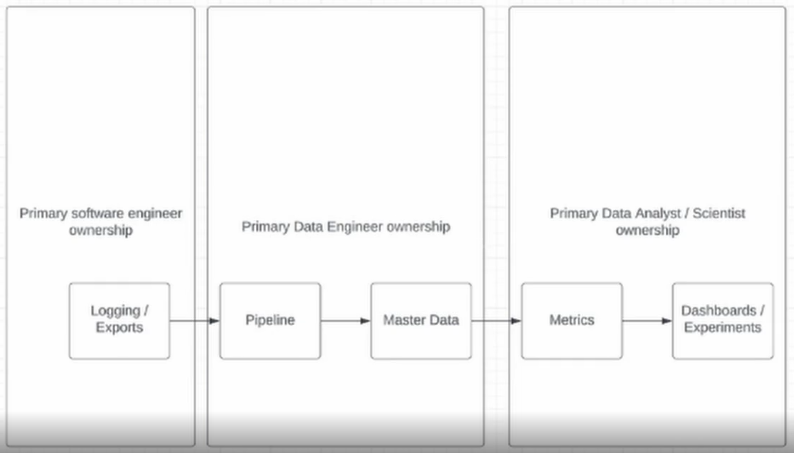
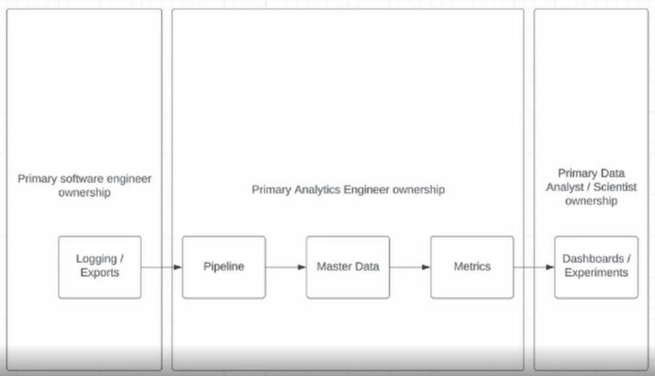
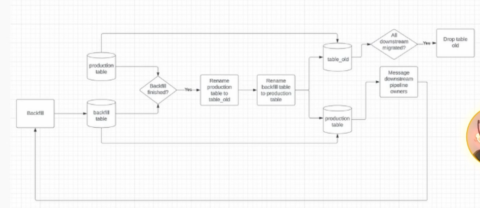

# Data Pipeline Maintenance
Every pipeline you build, slowly crushes you with maintenance costs.
- DE isn't just writing SQL and call it a day!
- DA & DS do the presentation and get the glory
- DA & DS don't have to be on call

## Contents
- hard part of the DE job
- Ownership models of datasets
- Team models of DE
- Common problems when maintaining pipelines

### hard part of DE
- High expectation / burnout
- DQ issues
- Unclear priorities / Adhoc requests

#### High Expectation / burnout
- building pipelines is a MARATHON
- analytics is a sprint
- SAY NO TO SPRINTING THE MARATHON!

#### Adhoc Requests
- Analytics need to solve URGENT problem
- Allocate 5-10% per quarter to adhoc requests
    - if request is complex, push back
    - if request is easy, just do it
- Most problems are less urgent than they appear
- Do quarterly planning with analytics partner (healthy relationship, less issues in the long run, more sustainable)

### Ownership Models
Who owns what?
- Datasets
- Pipelines
- Documentations
- Metrics
- Experiments

#### The most common ownership model
- Things can become blurry at the boarder.

#### Another common ownership model
- Things can also become blurry at the boarder.

#### Where do ownership problems arise?
AT THE BOUNDARIES!
- DE doing logging!
- DS doing pipelines!
- DE owning metrics!

#### What happens when crossed boundaries persist?
- BURNOUT!
- BAD TEAM DYNAMIC!
- THE BLAME GAME!
- BAD CROSS-FUNCTIONAL SUPPORT!

### Team Models (Centralized vs Embedded)
| Centralized                                              | Embedded                                              |
|----------------------------------------------------------|-------------------------------------------------------|
| Many DE in one team.                                     | DEs in other engineering teams.                       |
| Oncall is easier. Knowledge sharing. DEs supporting DEs. | Dedicated DE support. DE gains deep domain knowledge. |
| Expensive. Prioritization can get complex.               | Islands of responsibility. DEs can feel isolated.     |

### Common Problems when maintaining pipelines
- Skewed pipelines that OOM
- Missing data/schema change of upstream data
- Backfill needs to trigger downstream datasets
- Business questions about where and how to use data

#### How to fix skew
- Upgrade to Spark 3 & enable adaptive execution
- bump up executor memory & hope problem solved
- update the job with a join salt (like a random number column)

#### Missing data/ Schema Change
- quality check upstream data
    - prevent pipeline from running if missing data
- Track down upstream owner
    - Fill out a ticket to have them fix the issue (long term fix)

#### Backfill triggers downstream pipelines
- Small migration
    - do parallel backfill into **table_backfill**
    - if ok, just swap table name (production -> production_old, table_backfill -> production)
- if more people involved
    - build a parallel pipeline instead of just table

