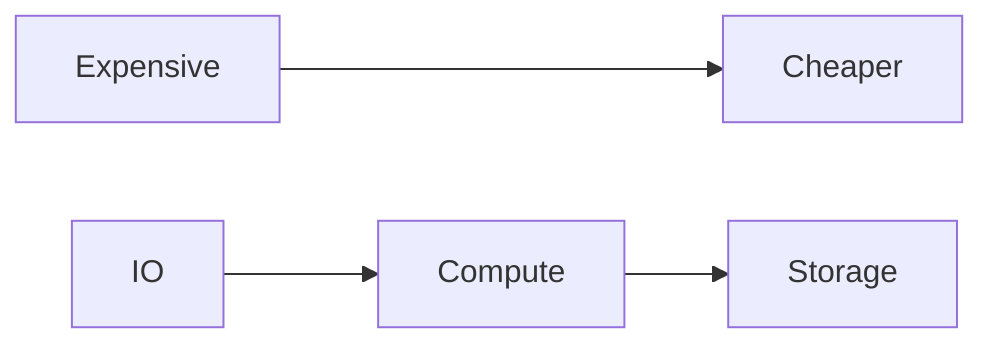
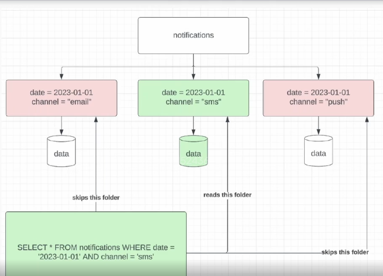
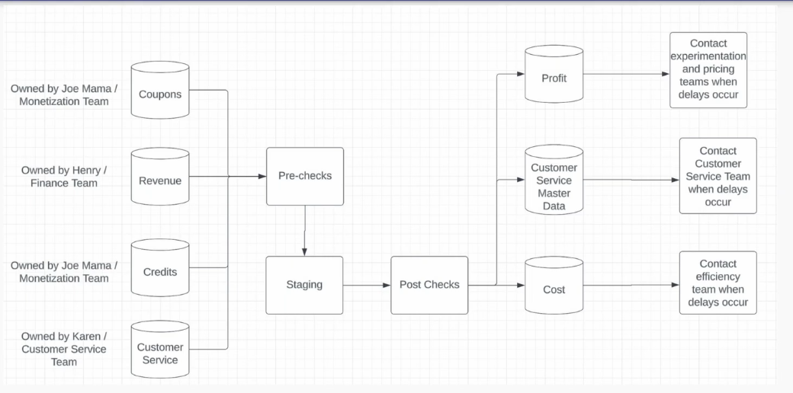

# Tech Debt in DE

## Signal of Tech Debt
- Painful pipelines that break
- Large cloud bills
- Multiple  sources of truth
- Unclear data documentation (or not existant)

### Painful pipelines
- Sometimes deprecated is better than optimized
- Options to deal with these pipelines:
    - New tech
    - Better data modeling
    - Bucketing
    - Sampling
    - Deprecating the pipeline (if nobody is using it)

#### Tech upgrade for pipelines
- Hive to Spark migration
    - often see an order of magnitude improvment in efficiency, especially pipelines that use high cardinality GROUP BY or JOIN

#### Sampling
- When we should
    - if directionality (not accuracy) is what you need, sampling is a good method
    - consult DS for correct sampling method to make sure data can represent the population
- When we shouldn't
    - auditing, PII, security purposes, need accuracy

#### Bucketing
- When we should
    - have expensive high cardinality GROUP BY or JOIN

### Large Cloud Bills
- usually for large companies：

#### When too much IO happens
- Duplicative data models
- inefficient pipelines (use cumulative design when possible)
- Excessive backfills
- Not sampling
- Not subpartitioning data correctly (like using predicate pushdown)

##### Why subpartition minimize IO

#### IO correlation with compute and storage
- IO & compute
    - scanning too much data (use cumulative table)
    - O(n^2) loop in UDF (nested loops are bad)
- IO & storage
    - Not leverage Parquet format effectively
    - Duplicative data models

### Multiple source of truth
- hardest (but most rewarding) part of DE
- Steps
    - documents all sources and discrepancies
    - understand from stakeholders why they need sth different
    - build a spec that combines all the needs that can be agreed upon

#### documents all sources and discrepancies
- talk with all relevant stakeholders
- code search for similar names
- Lineage of data source can be good place to start too

#### understand from stakeholders why they need sth different
- usually there is a reason
- could be organizational, technical, ownership, etc
- work with stakeholders to find an ownership model that works

#### build a pipeline spec
- get all the needs from stakeholders
- get all the owners to sign off (this helps a lot with migration later)

## Tech debt models
|      | Fix as you go                                                     | Allocate dedicated time each quarter                                | Have the oncall person do tech debt   |
|------|-------------------------------------------------------------------|---------------------------------------------------------------------|---------------------------------------|
| Pros | There isn't much incremental burden.                              | Fix things in big bursts. Actually fix lots of problems.            | They fix bugs as they arise.          |
| Cons | Tech debt rarely actually get tackled bcuz it's the last priority | Tie up team for a week. Tech debt builds up throughout the quarter. | Oncall person does nothing last week. |

## Data Migration Models
| Extremely cautious approach        | Bull in china shop approach                                             |
|------------------------------------|-------------------------------------------------------------------------|
| Very careful not to break anything | Kill legacy pipelines ASAP                                              |
| Parallel pipelines for months      | Efficiency wins, minimize risk by migrating high-impact pipelines first |

## Proper Oncall Responsibilities
- Set proper expectations with stakeholders
- DOCUMENT EVERY FAILURE AND BUG 
- Oncall handoff (20-30 min like passdown)

## Runbooks
Complex pipelines need runbooks (which can be linked to spec too).
- Most important pieces:
    - Primary & secondary owners
    - Upstream owners (teams not individuals)
    - Common issues (if any)
    - Critical downstream owners  (teams not individuals)
    - SLA & agreements

