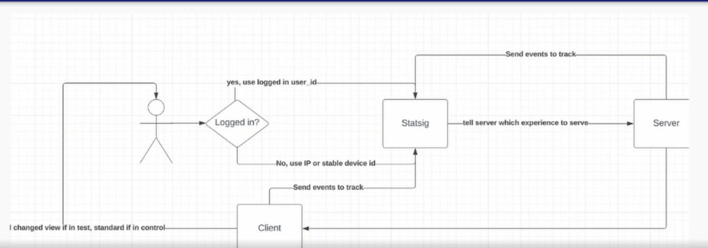

# KPIs and Experimentation

# Contents
- Metric play a huge part in data modeling
- Make sure metrics can't be 'gamed'
- Inner workings of experimentation
- feature gates vs experimentation
- How do you plug metrics into experimentation frameworks?

## Types of metrics
- Aggregates/Counts
- Ratios
- Percentiles(p10, p50, p90 values)

### Aggregates/Counts
- The Swiss army knife & the most common type DE should work with

### Ratios
- DE should supply the numerators and denominators, NOT THE RATIOS
- Examples:
    - Conversion rate, Purchase rate, Cost to acquire a customer

### Percentile Metrics
- Useful for measuring experience at the extremes
- Examples:
    - P99 latency, P10 engagement of active users

## Make sure metrics can't be 'gamed' (Need balance)
- Experiments can **fake metrics** up short-term but not good for long-term. We call this p-hacking.
- Example: 
    - Notification: Send more or 10x volume -> get more users short term
    - Fiddle with numerators or denominators
    - Novelty effects of experiments (Curiousity to new stuff)
    - Increased user retention at extreme cost (refresh feed too often)
- Make extra rules / metrics (**counter metrics**) to prevent metrics manipulation. 

## Inner workings of experimentation (Hypothesis testing)
- Make a hypothesis
- Group assignment (test vs control)
- Collect data 
- Compare the results

### Hypothesis testing
- null hypothesis
    - there is no difference
- alternative hypothesis 
    - there is a significant difference after the change

#### You never prove the H1. 
#### You reject / fail to reject the null hypothesis H0.

### Group Testing (Population)
- Who is eligible
    - how much users do we need (Sampling size)
    - Are these users in long-term holdout (control group)

### Collect data
- collect until we get a statistically significant result
- make sure to use stable ID
- the smaller the effect, the longer we have to wait
- more test you have, more data you need

### P-value
- p-value < 0.05 is industry standard
- statistical significant != big change (or delta)

### windsorization
- replace extreme outliers with less extreme value

### Statsig
- can create metrics
- or can also make your own metrics through batch ETLs