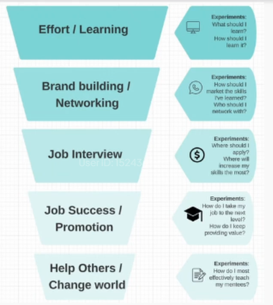
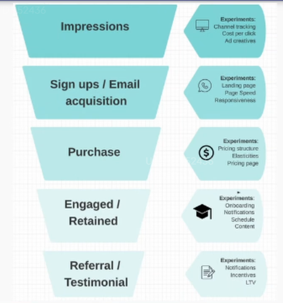

# Leading & Lagging Metrics

Most metrics are related to money in some form, either reduced cost or increased profits. This kind of metric moves very slowly. They are called **lagging metrics**.

## Example
- leading metric: hours spent practising SQL
- lagging metric: job offers received
- extreme lagging metric: how many students get better jobs after following the class

Conversion rate = hours spent / job interviews

## Learning / job funnel

## Funnel that run the world
