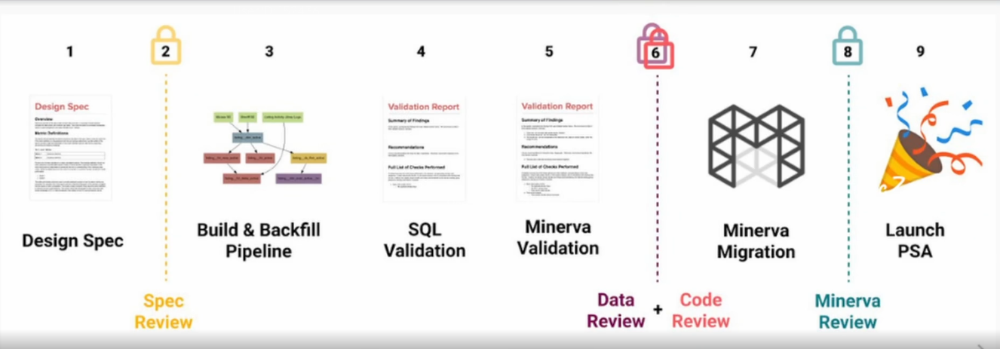

# Quality Patterns: MIDAS process

## Symptoms of bad data
- rage
- irritability
- insomia

## Contents
- how to build high trust in your data
- good data documentation
- DQ checks between facts and dims

### Data Quality means TRUST + IMPACT
- discoverable
- misunderstood, incomplete definitions of data quality
- easy to use
- arrives in time
- there is business value from the data
- No null or dupes

### how to build trust
- before start anything, LEAN INTO EMPATHY
    - eg. If no restriction on time & cost, what problems you wish to solve?
- Spec review of pipeline design
- clarify business impact before coding
- Ask downstream users about all current and future needs
- Follow Airbnb MIDAS process

### MIDAS process
- 1. Design spec
- 2. Spec review
- 3. Build & Backfill pipelines
    - backfill one month first
- 4. SQL validation (analyst checking)
- 5. Minerva validation
- 6. Data Review + Code Review
- 7. Minerva migration
- 8. Minerva review
- 9. Launch PSA

#### Why all these upfront work?
- Pre-build stakeholder bought increase trust
- make them feel like they have skin in game (they are involved)
- PREVENT PAINFULL BACKFILLS WHEN MISSING A REQUIREMENT

#### When should we do MIDAS process?
- Are important decision made from this data?
- Is this data gonna last for years?

### What is good in spec
- description (why build this)
- flow diagrams
- schemas
- quality checks
- metric definitions
- example queries

#### how a good schema looks like
- good names (fct, dim, scd, agg)
- comments on every column
- follow naming convention
- every company should follow some kind of naming convention

#### quality checks
- basic
    - NOT NULL, not empty, no dupes, enum values all valid
- intermediate
    - row cout, WoW row count
- advanced
    - seasonality adjusted row count

## DQ checks between facts and dims

### Dim DQ checks
- usually tables grow or flat day-over-day (Table is growing check)
- don't grow sharply (difference from last week should be small)
- have complex relationships that should be checked (like FK keys in relational tables)

### Fact DQ checks
- have seasonality (dont do DoD, use WoW)
- affected by holidays (Christmas -> fake positive)
- can grow or shrink (always grow check is not good here)
- more prone to dupes (dupes check is a must here)
- more prone to NOT NULL and other row-level quality issues
- have reference to entities that should exist (similar to FK checks)
- if possible, use APPROX_COUNT_DISTINCT (99.99% same but more efficient)