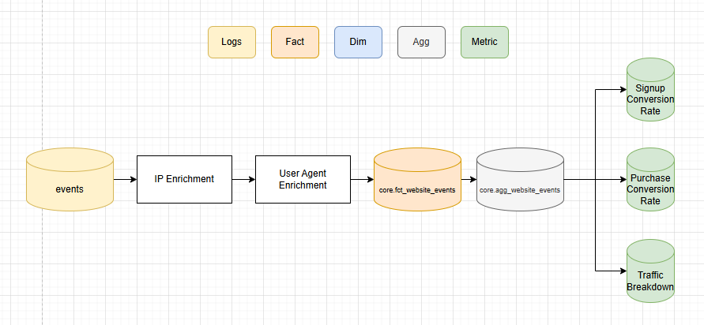

# EcZachly Inc User Growth Pipeline

EcZachly Inc is a new startup that wants to measure its website traffic and user growth.

The goal of this pipeline is to answer the following questions:

- How many people are going to [www.eczachly.com](www.eczachly.com) and [www.zachwilson.tech](www.zachwilson.tech) on a daily basis?
    - What is the geographical and device break down of that traffic?
    - Where are these people coming from? LinkedIn? Substack?

- How many people are signing up with an account on [www.eczachly.com/signup](www.eczachly.com/signup) each day?
    - What percentage of traffic is converting  to signing up?

- How many people are purchasing bootcamps and courses at [www.eczachly.com/bootcamp](www.eczachly.com/bootcamp)?
    - What percentage of signups convert to paying customers?

## Business Metrics
| Metric Name              | Definition                               | Is Guardrail? |
|--------------------------|------------------------------------------|---------------|
| signup_conversion_rate   | COUNT(signups) / COUNT(website_hits)     | Yes           |
| purchase_conversion_rate | COUNT(purchases) / COUNT(signups)        | Yes           |
| traffic_breakdown        | COUNT(website_hits) GROUP BY referrer | No            |

## Flow Diagram

## Schemas

### core.fct_website_events
This table is a list of all events for eczachly.com and includes IP enrichment and user agent enrichment for country and device specific information. The unique identifier for this table is **logged_out_user_id** and **event_timestamp**.

| Column Name        | Column Type         | Column Comment                                                                                                                  |
|--------------------|---------------------|---------------------------------------------------------------------------------------------------------------------------------|
| user_id            | BIGINT              | This column is nullable for logged out events.  This column indicates the user who generated this event.                     |
| logged_out_user_id | BIGINT              | This column is a hash of IP address and device information.  (We'll use the murmur3 hash.)                                   |
| dim_hostname       | STRING              | This is the host associated with this event (eczachly.com, zachwilson.tech, etc)                                                |
| dim_country        | STRING              | The country associated with the IP address of this request.                                                                     |
| dim_device_brand   | STRING              | The device brand associated with this request. Could be NULL because of bots that don't have a brand.                                                                                 |
| action_type        | STRING              | This is an enumerated list of actions that a user could take on this website. (signup, watch video, go to landing page, etc) |
| event_timestamp    | TIMESTAMP           | The UTC timestamp for when this event occured.                                                                                  |
| other_properties   | MAP(STRING, STRING) | Any other valid properties that are part of this request.                                                                       |
| ds                 | STRING              | This is the partition column for this table.                                                                                    |

#### Quality Checks
- Not NULL checks on (dim_hostname, dim_action_type, event_timestamp, dim_country, logged_out_user_id)
- Make sure no dupes on PK.
- dim_hostname is well formatted (something like this [www.xx.com](www.xx.com)).
- row count checks
    - GROUP BY dim_hostname and check WoW counts for [www.eczachly.com](www.eczachly.com) and [www.zachwilson.tech](www.zachwilson.tech)
- enumeration check on dim_action_type (should be signup, purchase, login, etc.)

---

### core.agg_website_events
This table is an aggregated view of all logged website events.

| Column Name       | Column Type | Column Comment                                                                                                                                                                                    |
|-------------------|-------------|---------------------------------------------------------------------------------------------------------------------------------------------------------------------------------------------------|
| dim_action_type   | STRING      | The enumerated action type.                                                                                                                                                                       |
| dim_country       | STRING      | The IP country.                                                                                                                                                                                   |
| dim_device_brand  | STRING      | The device brand (android, iphone, etc.)                                                                                                                                                          |
| event_hour        | INTEGER     | The hour this event took place in UTC                                                                                                                                                             |
| m_total_events    | BIGINT      | The total number of events for this slice                                                                                                                                                         |
| aggregation_level | STRING      | This is how this agg table is GROUPED. Values include ( dim_action_type, dim_country_dim_action_type, dim_country_dim_action_type_dim_device_brand_and_event_hour, (overall), ) |
| ds                | STRING      | This is the date partition for this table.                                                                                                                                                        |

#### Quality Checks
- Row count checks
    - (Overall) rollup should have more data than any other rollup
- Event_hour should look like its old seasonal pattern.
- m_total_events should be > some minimum number