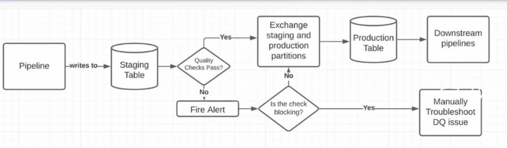
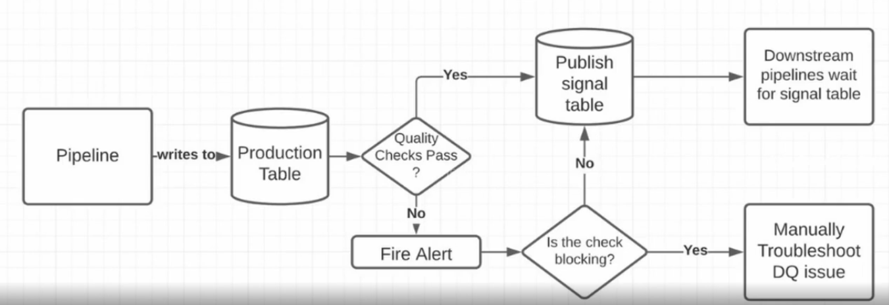

# DQ Pattern: Write Audit Publish WAP

## What causes bad data?
- Logging errors
- Snapshotting errors
- Production DQ issues
- Schema evolution issues
- Pipeline mistakes making into production
- Non-idempotent pipelines and backfill errors
- Not thorough enough validation

## Validation Best Practices
- Backfill small amount of data (1 month)
- have another person check all your assumptions
- produce a validation report
    - dupes
    - nulls
    - violations of business rules
    - time series / volume

## Writing to Production is a CONTRACT
- It means you checked the data the best you could
- Components of the contract:
    - Schema
    - Quality checks
    - How data shows up in prod

## Two type of contract
- WAP 
- Signal table

### WAP 
- writes to a staging table

### Signal table

### WAP vs signal table
|      | WAP                                                                                                                                                     | Signal tables                                                                                                                                                                                 |
|------|---------------------------------------------------------------------------------------------------------------------------------------------------------|-----------------------------------------------------------------------------------------------------------------------------------------------------------------------------------------------|
| Pros | - Downstream pipelines can intuitively depend on the prod table directly. - No chance of production data getting written without passing the audits. | - The data lands in 1 spot and never has to be moved. - More likely to hit SLA, data lands sooner.                                                                                         |
| Cons | Partition exchange can delay the pipeline by several minutes. More likely to miss SLA.                                                                  | - Non intuitive for downstream users. What if they forget that you have a signal table? Higher likelihood of propagating DQ errors. - May return results from data that has failed audits. |

## What happen when contracts are violated?
- bad data propagation
- severity depends on how upstream the pipeline is

## bad/complex metric definitions can cause bad data also
- the more complex / the more dimensions a metric depends on, the more prone it is to error.